# HesAPP: Restaurant & Café POS System

HesAPP is a touch-first point-of-sale (*adisyon*) system that I built for a real café, where staff use it every day.
It runs entirely on the local network and needs no internet connection. Waiters take table orders on tablets, and a
touchscreen register PC acts as the cash desk and server. Every device stays in sync in real time. The cashier takes
split or partial payments, prints ESC/POS receipts and kitchen tickets on thermal printers, keeps customer tabs and
closes the day with a Z-report. Customers browse the live menu on a separate touchscreen kiosk.

> **Source code is private** because the system runs in production at a client business.
> A code walkthrough is available on request.

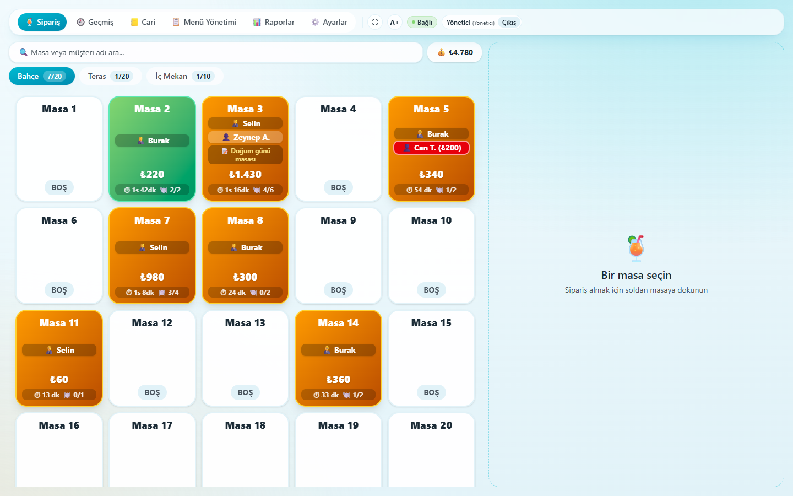

## Screenshots

All screenshots come from a demo instance with invented data: products, prices, customers and staff are made up, and
the kiosk product images are placeholder illustrations. The user interface is in Turkish because it was built for a
Turkish business.

<table>
  <tr>
    <td width="50%">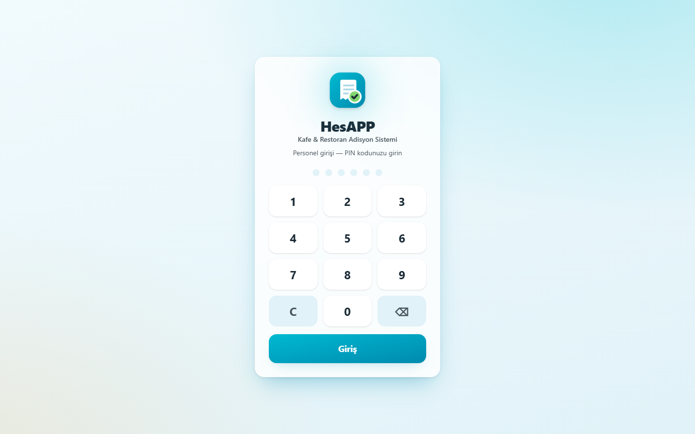<br><sub><b>PIN login.</b> Staff sign in with a personal PIN. There are three roles: Waiter, Cashier and Manager.</sub></td>
    <td width="50%"><br><sub><b>Tables by zone.</b> Each open ticket shows its total, time open, served items, staff member, notes and the customer's unpaid balance (red). Green means everything has been served.</sub></td>
  </tr>
  <tr>
    <td>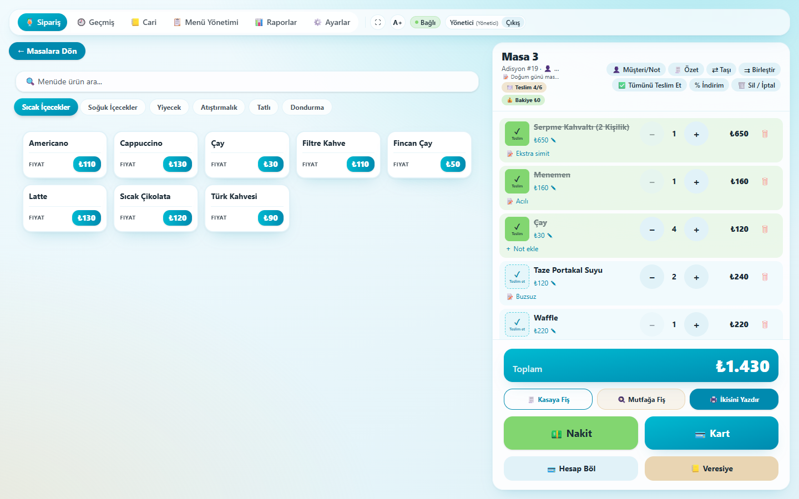<br><sub><b>Order screen.</b> The menu by category is on the left. The table's ticket is on the right, with per-item notes, served tracking, printing and checkout.</sub></td>
    <td>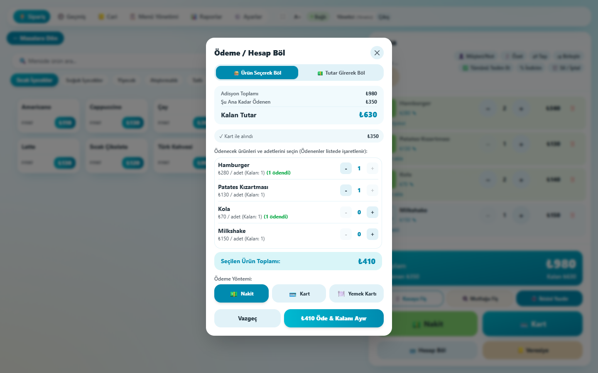<br><sub><b>Split bill by items.</b> Some items are already paid by card. The rest can be paid by cash, card or meal card, or by entering an amount.</sub></td>
  </tr>
  <tr>
    <td>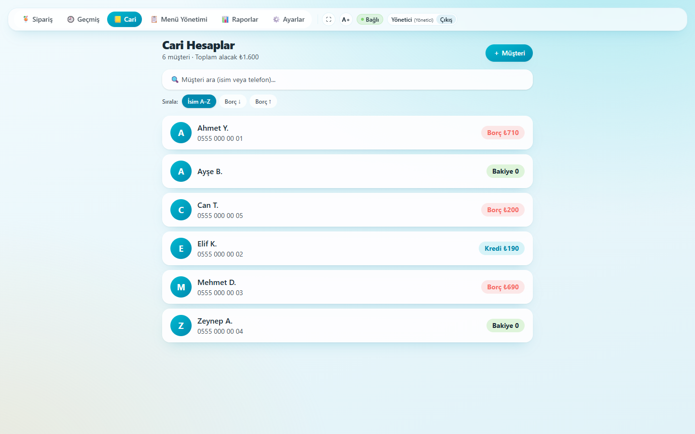<br><sub><b>Customer accounts (<i>cari</i>).</b> Running balances show who owes money and who has prepaid credit.</sub></td>
    <td>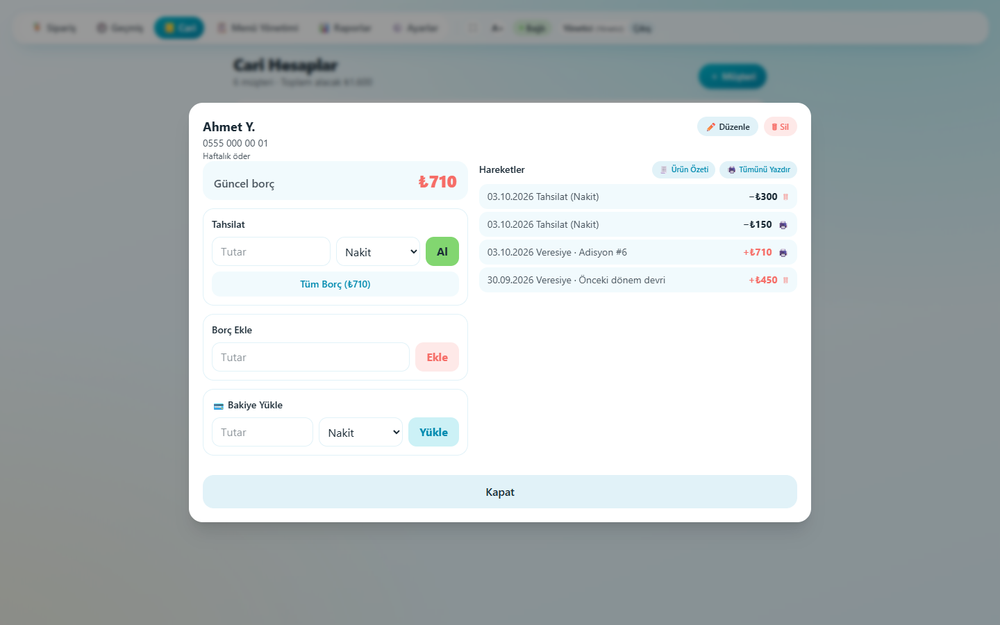<br><sub><b>Customer ledger.</b> Collections, on-account tickets, manual debt entries and prepaid top-ups, with reprintable receipts.</sub></td>
  </tr>
  <tr>
    <td>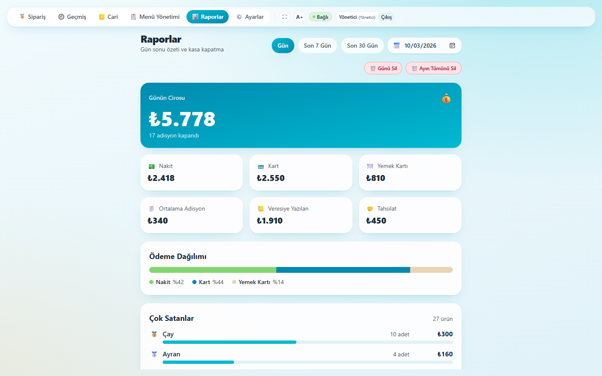<br><sub><b>Daily report.</b> Revenue, the split between payment methods, average ticket, debt written vs. collected and best sellers.</sub></td>
    <td>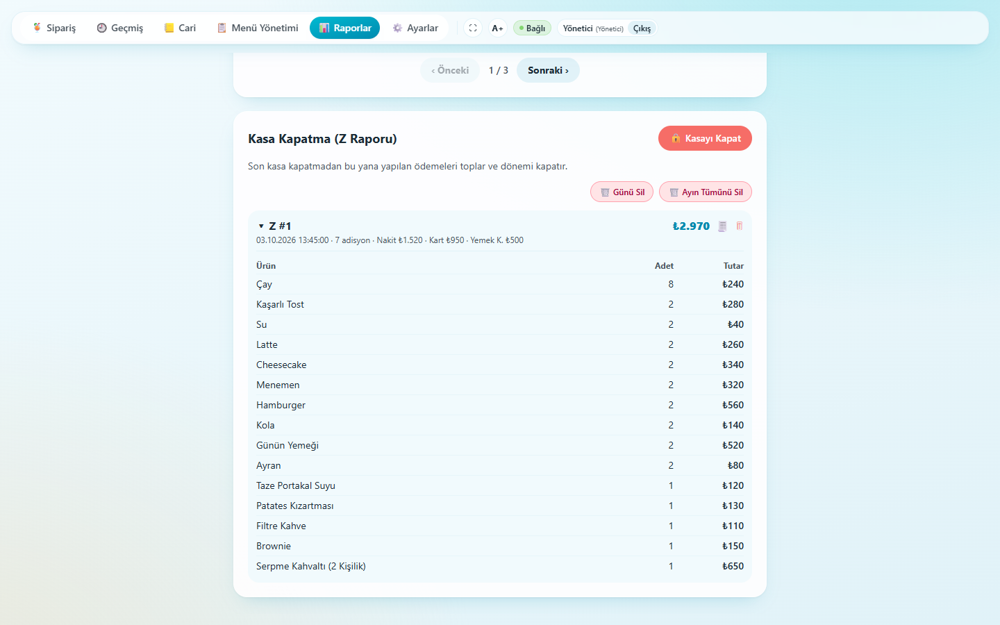<br><sub><b>Z-report.</b> The end-of-shift close has a sequential number, payment totals and a per-product breakdown.</sub></td>
  </tr>
  <tr>
    <td>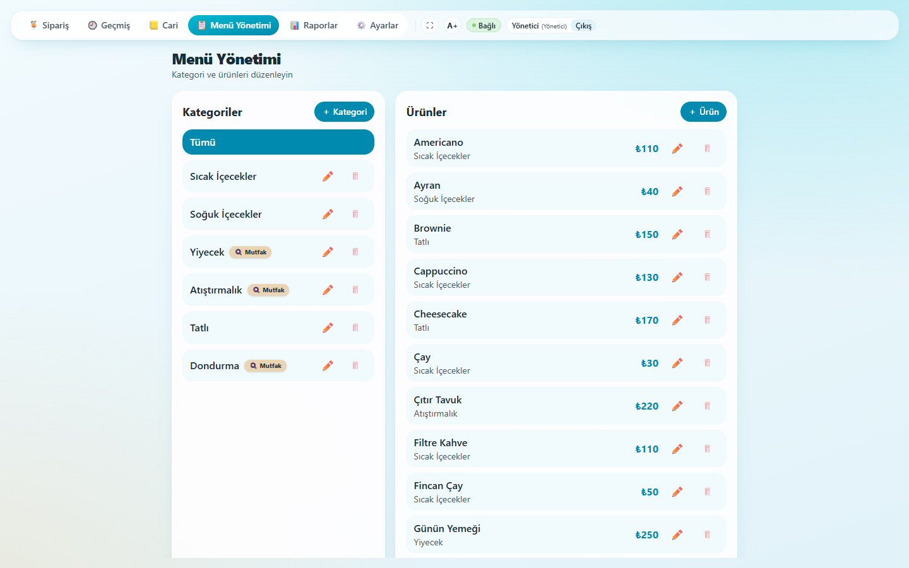<br><sub><b>Menu management.</b> Categories (with a kitchen-printer flag) and products, including open-price items.</sub></td>
    <td>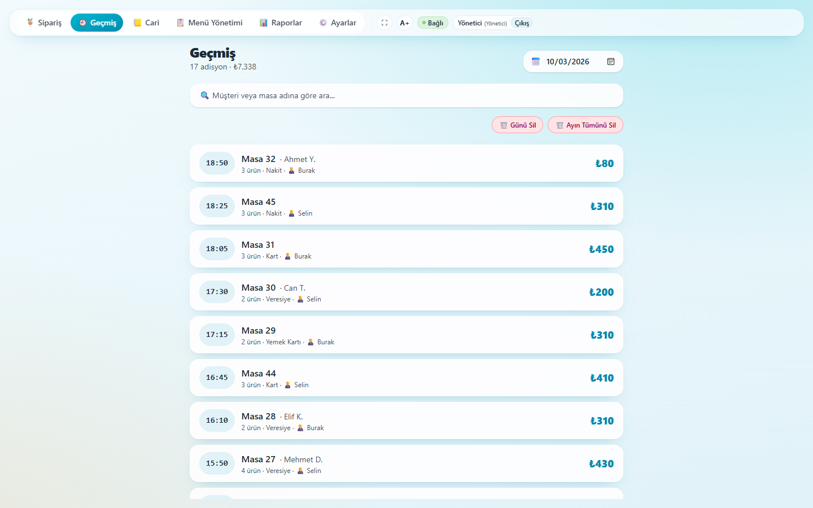<br><sub><b>History.</b> Closed tickets by day, each with its payment method, customer and staff member.</sub></td>
  </tr>
  <tr>
    <td>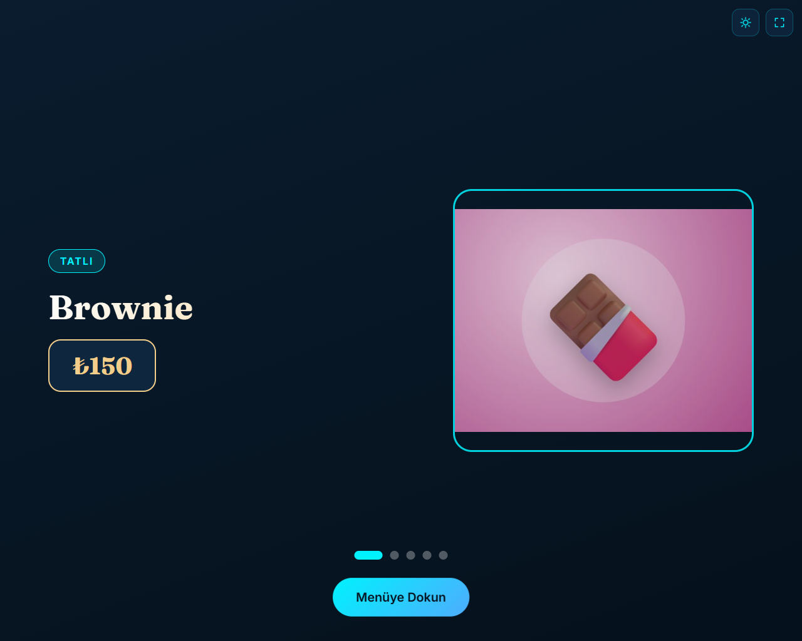<br><sub><b>Customer kiosk, idle.</b> When nobody is using the kiosk, an attract screen cycles through products from the live menu.</sub></td>
    <td>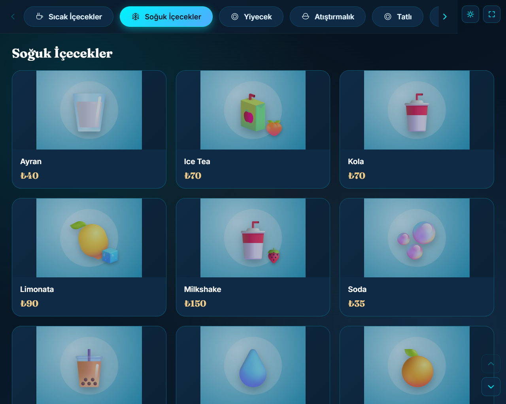<br><sub><b>Customer kiosk, menu.</b> Customers browse categories with photos and prices, which the kiosk pulls from the POS and caches for offline use.</sub></td>
  </tr>
</table>

## Features

**Orders & tables**
- Table grid grouped into zones. A manager can add, rename and remove tables and zones
- One ticket per table: add items, change quantities, per-item notes, open-price items and ticket notes
- Move a ticket to another table, or merge two tables into a single bill
- Track which items have been served. A table turns green when everything is served
- Search tables by table or customer name, and see a live total of all open tickets

**Payments**
- Cash (with change calculator), card, meal card and "on account" (charged to the customer's tab)
- Partial payments and split bills, either by amount or by selecting items. The ticket closes automatically when fully paid
- Percentage or fixed discounts, or comp the whole ticket (manager only)
- Cash drawer kick on cash payments

**Customer accounts (*cari*)**
- Customer tabs with charges, collections and prepaid top-ups, and a running balance
- When closing a ticket for a customer who owes money, the cashier sees a reminder and can collect old debt on the same receipt
- Printable per-customer summary of everything bought since the balance was last settled

**Reports**
- Daily and date-range reports: revenue, cash / card / meal-card breakdown, every product sold ranked by quantity,
  and debt written vs. collected
- Z-report (shift / end-of-day close) with sequential unique numbers, a payment breakdown and per-product lines, plus Z-report history
- Closed-order history, with cleanup by date range

**Staff & security**
- PIN login with three roles (Waiter, Cashier, Manager) and role-based authorization on every API endpoint
- PINs are hashed with PBKDF2-SHA256 (100,000 iterations). Sessions use JWT bearer tokens that expire after 12 hours
- The JWT signing key is generated at startup and kept only in memory, so there are no secrets in config
- Sessions are revoked immediately when a staff member is deactivated, changes role or gets a new PIN
- Login is rate-limited, and Settings shows a warning while any account still uses a default or weak PIN

**Printing**
- ESC/POS receipts for 80 mm thermal printers, sent over TCP (port 9100) or to a Windows-installed USB printer through the raw spooler
- Optional separate kitchen printer. Kitchen tickets include only kitchen categories and only items not yet sent
- Browser printing as a fallback when no printer is configured

**Real-time LAN setup**
- A SignalR hub broadcasts order, table and menu changes to every device, with automatic reconnect
- One PC runs the server and tablets connect over Wi-Fi. No internet connection is required
- Installable PWA. The register runs it in fullscreen Edge kiosk mode on a touchscreen
- Large-text mode and colour themes

**Customer menu kiosk**
- Touchscreen menu for customers: an animated attract screen when idle, and category browsing with product photos and prices
- Pulls the live menu from the POS every 60 seconds and caches it locally, so it keeps working if the server is briefly offline
- Product photos and "featured" flags are managed from the POS menu screen and served through public read-only menu endpoints
- Plain HTML, CSS and JavaScript with self-hosted fonts. No build step, and it runs offline in Edge app mode

**Data safety**
- SQLite in WAL mode, with automatic `VACUUM INTO` backups at startup and every 24 hours (the latest 14 are kept)
- Managers can download a consistent database backup from the UI
- Products and tables that appear in past orders cannot be deleted (products can be deactivated instead), so history is never lost

## Tech stack

| Layer | Technology |
|---|---|
| Backend | ASP.NET Core Web API, .NET 10 |
| Data | Entity Framework Core 10, SQLite, code-first migrations |
| Real-time | ASP.NET Core SignalR |
| Auth | JWT bearer, PBKDF2 PIN hashing, ASP.NET Core rate limiter |
| Frontend | React 19, TypeScript, Vite, Tailwind CSS 4, `@microsoft/signalr` |
| PWA | `vite-plugin-pwa` (Workbox) |
| Printing | Raw ESC/POS over TCP or the Windows print spooler (P/Invoke) |
| Tests | xUnit, FluentAssertions, Moq (backend); Vitest (frontend) |
| Kiosk menu | Vanilla HTML, CSS, JavaScript |
| Tooling | oxlint, OpenAPI document in development |

## Architecture

```
[ React PWA ]  waiter tablets + touchscreen register, in the browser
     |   REST     /api/*          (JWT bearer)
     |   SignalR  /hubs/orders    (OrderChanged, TableChanged, MenuChanged)
     v
[ ASP.NET Core API ]  one process on the register PC, also serves the built client
     |-- EF Core ----------------> SQLite  pos.db  (WAL mode)
     |-- BackupService ----------> backups/pos-*.db  (VACUUM INTO, every 24 h, keep 14)
     |-- ReceiptPrinter (ESC/POS)
     |     '-- IPrinterTransport --> TCP :9100 network printer  |  Windows USB printer (spooler)
     '-- public menu endpoints (read-only, no auth)
           ^
           |   GET categories / products / photos every 60 s, cached in localStorage
[ Customer kiosk menu ]  static HTML/CSS/JS on a touchscreen, Edge app mode
```

The solution has four parts: the ASP.NET Core API (controllers, EF Core models and migrations, auth, printing,
backups, SignalR hub), the React + TypeScript client, an xUnit test project and the static kiosk menu.

## Engineering highlights

- **Multi-device concurrency.** Several tablets can work on the same table at once. A filtered unique index
  (`TableId WHERE Status = Open`) guarantees one open ticket per table, and a race on opening a table falls back to
  the existing ticket. Per-order async locks serialize changes to a ticket. Merges take both locks in id order to
  avoid deadlocks. Every ticket has a version counter that is incremented in one central place (`SaveChanges`), and
  clients drop SignalR updates that are older than their local copy.
- **Immediate session revocation.** JWTs carry a token-version claim that is checked on every request. Deactivating
  a staff member, changing their role or resetting their PIN invalidates their existing tokens at once, without
  waiting the 12 hours until they expire.
- **PIN security.** PINs are hashed with PBKDF2-SHA256 (100,000 iterations, random salt). Login is rate-limited to
  5 attempts per minute per IP, so a device on the LAN cannot brute-force a 4-digit PIN.
- **Printing that cheap printers survive.** ESC/POS jobs go out in paced chunks (small writes with short delays and
  a settle time). A per-printer gate sends one job at a time, which keeps low-cost thermal printers from locking up
  under bursts. Kitchen tickets only include kitchen categories and items that have not been sent yet.
- **Money is never counted twice.** Item-based split payments track paid quantities per line. A ticket-level discount
  is spread proportionally over item-based splits. Overpayments are clamped to the remaining amount, and fully comped
  tickets can still be closed. Old debt collected together with a ticket is recorded in the customer ledger, not as
  ticket revenue, so it does not appear twice in reports.
- **Automatic backups.** `VACUUM INTO` produces consistent, WAL-safe snapshots at startup and every 24 hours, with
  rotation. Foreign-key cascades are guarded so that deleting a product or table can never wipe order history.
- **Real-time sync that tolerates flaky Wi-Fi.** SignalR pushes changes to every device. Clients reconnect
  automatically, refresh after a reconnect and also poll every 20 seconds, so a silently dropped WebSocket cannot
  leave a tablet showing stale data.
- **Tested.** 208 backend xUnit tests cover the controllers (orders, payments, customers, reports, Z-reports, menu,
  tables, staff, printing), session validation, PIN hashing, ESC/POS generation and concurrent order handling.
  Vitest unit tests cover the client's helper modules.

## Author

Author: Fatih Erdoğan · https://fatiherdogan.live · https://www.linkedin.com/in/fatih-erdogan

© 2026 Fatih Erdoğan. All rights reserved.
